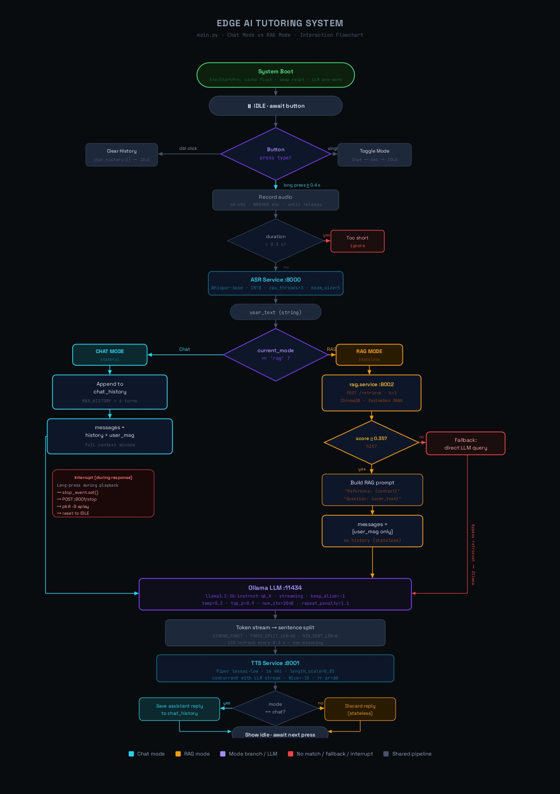

# Edge AI Tutoring System on Raspberry Pi 5

> A fully offline, voice-interactive AI tutoring system running entirely on a Raspberry Pi 5 — no cloud, no internet required.

**中文版本见下方 👇**

---

## 📖 Overview

This project implements a **fully offline Edge AI Tutoring System** on a Raspberry Pi 5. It supports natural voice interaction and context-aware question answering over user-uploaded learning materials, powered by four independently managed services running entirely on-device.

Developed as a Final Year Project (FYP) at Nanyang Technological University (NTU), School of Electrical & Electronic Engineering.

---

## ✨ Features

- 🎙️ **Voice-in / Voice-out** — Whisper-base (INT8) ASR + Piper TTS (lessac-low) for fully spoken interaction
- 🤖 **On-device LLM** — Llama 3.2 3B Instruct (Q6_K) via Ollama, entirely local
- 📚 **RAG / Learning mode** — Place PDFs in `data/`, run `ingest_pdf.py`, and ask questions about them; relevant context retrieved via ChromaDB + fastembed ONNX
- 💬 **Chat mode** — General-purpose multi-turn conversation with up to 6-turn history
- ⚡ **Edge-optimised** — ~1.74s TTFT in chat mode; ~10.94s TTFT in RAG mode (~54× faster than the naive baseline)
- 🔒 **Fully offline** — All inference runs on-device; no data leaves the hardware
- 🖥️ **Display integration** — Real-time UI on the WhisPlay HAT's 240×280 LCD with RGB LED state feedback

---

## 🏗️ Architecture


The system is composed of four independently managed services, all running on-device:

| Service | Role | Port | Process Priority |
|---|---|---|---|
| `asr.service` | Whisper-base INT8 ASR | 8000 | default |
| `tts.service` | Piper lessac-low TTS | 8001 | `Nice=-15`, RT scheduling |
| `ollama.service` | LLM serving | 11434 | default |
| `aitutor.service` | Main orchestration app | — | `Nice=-20`, RT scheduling, `MEMLOCKED` |

### AI Stack

| Component | Model | Details |
|---|---|---|
| ASR | `whisper-base` | INT8 quantised, `cpu_threads=3`, `beam_size=5` |
| LLM | `llama3.2:3b-instruct-q6_K` | Served via Ollama; `temperature=0.3`, `num_ctx=2048` |
| TTS | `en_US-lessac-low` | Piper, 16 kHz output, `length_scale=0.85`, pre-warmed on startup |
| Embeddings | `BAAI/bge-small-en-v1.5` | fastembed ONNX, runs in isolated process |
| Vector DB | ChromaDB | Collection: `electronics_knowledge`, `chunk_size=300`, `overlap=30` |

---

## 📁 Project Structure

```
edge-ai-tutor/
├── README.md
├── LICENSE
├── CONTRIBUTING.md
├── Modelfile.q6              # Ollama custom model definition
├── requirements.txt
│
├── src/
│   ├── main.py               # Main orchestration app
│   ├── asr_server.py         # ASR FastAPI service (port 8000)
│   ├── tts_server.py         # TTS FastAPI service (port 8001)
│   ├── ingest_pdf.py         # PDF ingestion → ChromaDB vector store
│   └── WhisPlay.py           # WhisPlay HAT driver (LCD, RGB LED, button)
│
├── systemd/
│   ├── asr.service
│   ├── tts.service
│   ├── ollama.service
│   └── aitutor.service
│
├── docs/
│   ├── System Architecture Diagram.jpg
│   └── Flowchart.jpg
│
├── models/                   # Model weights (not tracked by git)
│   ├── whisper-base/
│   └── en_US-lessac-low.onnx
│
└── data/                     # Place your PDF files here
```

---

## 🚀 Getting Started

### Hardware Requirements

- **Raspberry Pi 5** (8 GB RAM recommended)
- **WhisPlay HAT** — provides the WM8960 sound card (microphone + speaker), 240×280 SPI LCD, RGB LED, and push button in a single board

### Software Prerequisites

```bash
# Python 3.11+
python3 --version

# Install Ollama
curl -fsSL https://ollama.com/install.sh | sh

# Pull the base LLM
ollama pull llama3.2:3b-instruct-q6_K
```

### Installation

```bash
git clone https://github.com/<your-username>/edge-ai-tutor.git
cd edge-ai-tutor

# Create and activate virtual environment
python3 -m venv .
source bin/activate

pip install -r requirements.txt
```

### Build the Custom Ollama Model

```bash
ollama create llama3.2-3b-q6 -f Modelfile.q6
```

### Ingest Your Learning Materials

```bash
# Place your PDFs into data/
cp your_notes.pdf data/

# Build the ChromaDB vector store
python3 src/ingest_pdf.py
```

### Install and Enable systemd Services

```bash
sudo cp systemd/*.service /etc/systemd/system/
sudo systemctl daemon-reload
sudo systemctl enable ollama asr tts aitutor
sudo systemctl start ollama asr tts aitutor
```

### Manual Launch (without systemd)

```bash
python3 src/asr_server.py &
python3 src/tts_server.py &
python3 src/main.py
```

---

## 🎮 Usage

Interact with the system entirely by voice via the WhisPlay HAT:

- **Press the button** to begin speaking
- **Release** to send your query
- The **RGB LED** indicates system state (listening / thinking / speaking)

The system supports two interaction modes, toggled with a single button click:

**Chat mode** maintains up to 6 turns of conversation history for coherent multi-turn dialogue.

**RAG / Learning mode** is triggered automatically when your query semantically matches content in the vector store (threshold: 0.35). Each query is answered independently using only the retrieved document context — stateless by design, to prevent history contamination of retrieval-augmented responses.

### Interaction Flowchart



| Gesture | Action |
|---|---|
| Long press | Record and send voice query |
| Single click | Toggle Chat ↔ RAG mode |
| Double click | Clear conversation history |
| Long press (during response) | Interrupt and stop playback |

---

## ⚙️ Key Configuration

| Parameter | Value | Source |
|---|---|---|
| ASR compute type | `int8` | `asr_server.py` |
| ASR CPU threads | `3` | `asr_server.py` |
| TTS sample rate | `16000 Hz` | `tts_server.py` |
| TTS length scale | `0.85` | `tts_server.py` |
| LLM temperature | `0.3` | `Modelfile.q6` |
| LLM context window | `2048` tokens | `Modelfile.q6` |
| RAG similarity threshold | `0.35` | `main.py` |
| RAG top-k retrieval | `1` | `main.py` |
| Chat history turns | `6` | `main.py` |
| Chunk size | `300` tokens | `ingest_pdf.py` |
| Chunk overlap | `30` tokens | `ingest_pdf.py` |

---

## ⚡ Performance

| Metric | Value |
|---|---|
| Chat TTFT | ~1.74 s |
| RAG TTFT | ~10.94 s |
| Naive baseline TTFT | ~93 s |
| Improvement | **~54×** |

> TTFT = Time to First Token. Measured on Raspberry Pi 5 (8 GB).

**Key optimisation:** fastembed ONNX runs in a process isolated from Ollama, eliminating heap contention that would otherwise evict the LLM's KV cache. TTS and LLM inference run concurrently via non-blocking HTTP. The `aitutor.service` pre-clears OS page cache, resets swap, and pre-warms the model into RAM before the app starts.

---

## 🛠️ systemd Service Details

The `aitutor.service` performs the following `ExecStartPre` steps before launching the app:

1. **Disk sync + cache flush** — `sync && echo 3 > /proc/sys/vm/drop_caches`
2. **Swap reset** — `swapoff -a && swapon -a` to force model weights into RAM
3. **Ollama readiness poll** — polls `localhost:11434/api/tags` until the server responds
4. **Model pre-warm** — sends a blank `generate` request to load model weights into Ollama's KV cache

Process priorities across all services:

| Service | Nice | CPU Scheduling |
|---|---|---|
| `aitutor.service` | -20 | `rr`, priority 50, `MEMLOCKED` |
| `tts.service` | -15 | `rr`, priority 60 |
| Piper subprocess | -10 | — |
| `asr.service` | default | — |
| `ollama.service` | default | — |

---

## 📄 License

This project is licensed under the [MIT License](LICENSE).

---

## 🙏 Acknowledgements

- [Ollama](https://ollama.com/) — Local LLM serving
- [faster-whisper](https://github.com/SYSTRAN/faster-whisper) — CTranslate2-based Whisper inference
- [Piper TTS](https://github.com/rhasspy/piper) — Fast, local neural TTS
- [ChromaDB](https://www.trychroma.com/) — Embedded vector database
- [fastembed](https://github.com/qdrant/fastembed) — Lightweight ONNX embedding inference
- Nanyang Technological University, School of EEE

---
---

# 边缘 AI 教学系统（Raspberry Pi 5）

> 完全离线的语音交互式 AI 教学系统，运行于 Raspberry Pi 5 上，无需云端或互联网连接。

---

## 📖 项目简介

本项目在 Raspberry Pi 5 上实现了一套完全离线的**边缘 AI 教学系统**，支持自然语音交互，并可针对用户上传的学习材料进行上下文感知问答。系统由四个独立管理的 systemd 服务组成，全部在本地设备上运行。

本项目为南洋理工大学（NTU）电气与电子工程学院毕业设计（FYP）作品。

---

## ✨ 功能特性

- 🎙️ **语音输入/输出** — Whisper-base（INT8）ASR + Piper TTS（lessac-low），实现全程语音交互
- 🤖 **本地 LLM** — Llama 3.2 3B Instruct（Q6_K）通过 Ollama 本地运行，无需联网
- 📚 **RAG 学习模式** — 将 PDF 放入 `data/` 并运行 `ingest_pdf.py`，即可基于文档内容进行语义检索问答
- 💬 **对话模式** — 通用多轮对话，最多保留 6 轮历史上下文
- ⚡ **边缘优化** — 对话模式首字时延约 1.74 秒，RAG 模式约 10.94 秒（较基线提升约 54 倍）
- 🔒 **完全离线** — 所有推理在本地完成，数据不离开设备
- 🖥️ **显示集成** — 在 WhisPlay HAT 的 240×280 LCD 上实时显示状态，RGB LED 指示系统状态

---

## 🏗️ 系统架构


---

## 🎮 使用方式

通过 WhisPlay HAT 全程语音交互，支持两种模式（单击按键切换）：

**对话模式** — 保留最多 6 轮历史，适合通用问答与闲聊。

**RAG 学习模式** — 语义路由匹配成功后自动触发，每次查询独立检索，无历史积累（有状态设计）。


| 手势 | 功能 |
|---|---|
| 长按 | 录音并发送语音查询 |
| 单击 | 切换 Chat ↔ RAG 模式 |
| 双击 | 清空对话历史 |
| 回答过程中长按 | 打断并停止播放 |

---

## 🚀 快速开始

```bash
git clone https://github.com/<your-username>/edge-ai-tutor.git
cd edge-ai-tutor

python3 -m venv .
source bin/activate
pip install -r requirements.txt

ollama pull llama3.2:3b-instruct-q6_K
ollama create llama3.2-3b-q6 -f Modelfile.q6

# 导入学习材料
cp your_notes.pdf data/
python3 src/ingest_pdf.py

# 安装并启动服务
sudo cp systemd/*.service /etc/systemd/system/
sudo systemctl daemon-reload
sudo systemctl enable ollama asr tts aitutor
sudo systemctl start ollama asr tts aitutor
```

---

## ⚡ 性能

| 指标 | 数值 |
|---|---|
| 对话模式首字时延 | ~1.74 秒 |
| RAG 模式首字时延 | ~10.94 秒 |
| 优化前基线 | ~93 秒 |
| 提升幅度 | **~54 倍** |

---

## 📄 许可证

本项目基于 [MIT 许可证](LICENSE) 开源。
